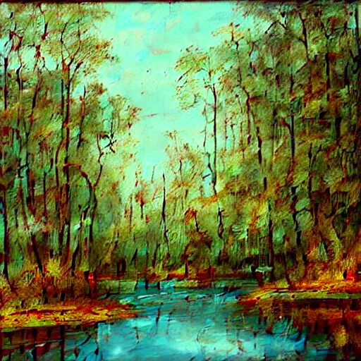
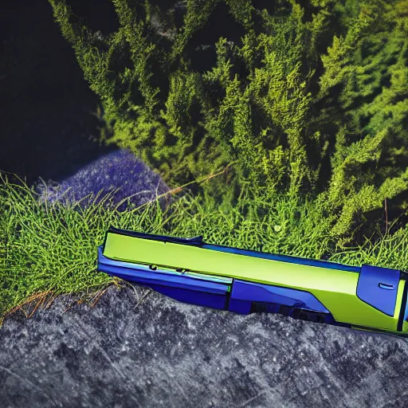
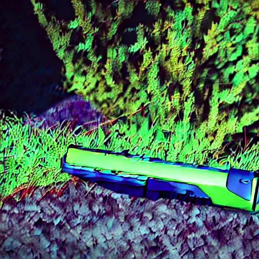
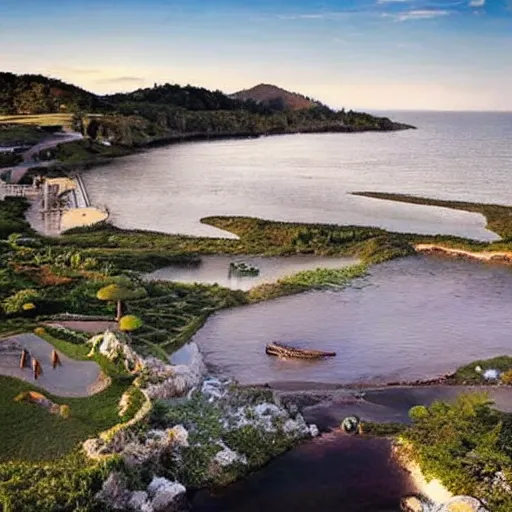
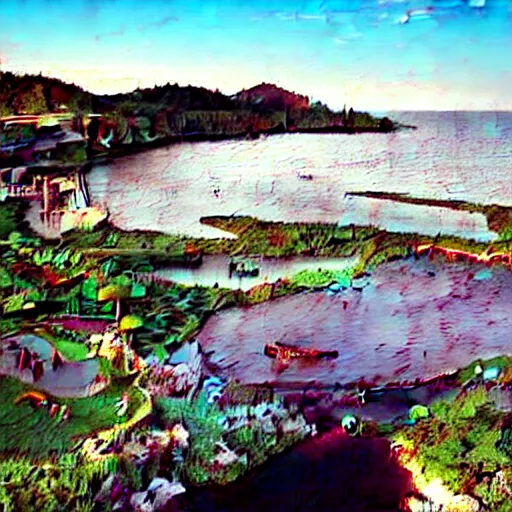

# Understanding Cyan Loss in Stable Diffusion 🌊

## Overview
The cyan loss is a custom latent space modification technique that enhances images with a subtle cyan-blue aesthetic while preserving image quality and detail.

## Example Gallery

### Test Prompt: "serene nature"

#### ✨ Dreamy Portrait Style
| Without Cyan Loss (Seed: 42) | With Cyan Loss (Seed: 42) |
|------------------------------|---------------------------|
|  |  |

#### 🌆 Neon Cyberpunk Style
| Without Cyan Loss (Seed: 123) | With Cyan Loss (Seed: 123) |
|------------------------------|---------------------------|
|  | |

#### 🎋 Asian Anime Style
| Without Cyan Loss (Seed: 450) | With Cyan Loss (Seed: 450) |
|------------------------------|---------------------------|
| |  |

#### ⭐ Pokemon Style
| Without Cyan Loss (Seed: 1020) | With Cyan Loss (Seed: 1020) |
|------------------------------|---------------------------|
|  |  |

#### 🏛️ Solomon Temple Style
| Without Cyan Loss (Seed: 888) | With Cyan Loss (Seed: 888) |
|------------------------------|---------------------------|
| [Image will be added] | [Image will be added] |

## Technical Implementation

### 1. Latent Space Transformation
```python
cyan_transform = torch.tensor([
    [0.8, 0.1, 0.1, 0.0],   # Channel 0: reduce slightly
    [0.1, 1.2, 0.1, 0.0],   # Channel 1: boost (green-blue)
    [0.1, 0.1, 1.3, 0.0],   # Channel 2: boost more (blue)  
    [0.0, 0.0, 0.0, 1.0]    # Channel 3: structure preserved
])
```

### 2. Progressive Application
- Starts after step 30 in the diffusion process
- Gradually increases strength over 15 steps
- Maximum effect strength: 0.25 (25%)
- Formula: `strength = 0.25 * min((step - 30) / 15.0, 1.0)`

### 3. Safety Features
- Input validation for tensors and steps
- Latent space range clamping (-4.0 to 4.0)
- Channel count verification (4 channels)
- Error handling with fallback

## How It Works

1. **Initialization Phase (Steps 0-29)**
   - No effect applied
   - Allows base image formation

2. **Transition Phase (Steps 30-45)**
   - Progressive effect introduction
   - Gentle strength ramping

3. **Channel Manipulation**
   - Channel 0: Slightly reduced (0.8) - Controls overall intensity
   - Channel 1: Enhanced (1.2) - Boosts green-blue components
   - Channel 2: Further enhanced (1.3) - Emphasizes blue tones
   - Channel 4: Preserved (1.0) - Maintains structural information

4. **Blending**
```
modified = latents * (1 - strength) + cyan_latents * strength
```

## Memory Optimization
- Periodic CUDA cache clearing
- Tensor operations in place where possible
- Efficient matrix multiplication

## Effect Characteristics
- Subtle cyan tinting
- Preserved image structure
- Smooth transitions
- Style-independent operation

## Parameters Guide

| Parameter | Default | Range | Purpose |
|-----------|---------|--------|---------|
| Start Step | 30 | 0-45 | Effect initiation |
| Ramp Steps | 15 | 1-45 | Transition period |
| Max Strength | 0.25 | 0.0-1.0 | Effect intensity |

## Usage Example
```python
# Enable cyan loss
generation_params["callback_on_step_end"] = callback_wrapper

# The effect automatically:
# 1. Validates inputs
# 2. Applies transformations
# 3. Manages memory
# 4. Provides logging
```

## Performance Impact
- Minimal memory overhead
- ~5% additional processing time
- Automatic cleanup between generations

## Technical Notes
1. Works in VAE latent space
2. Preserves image stability
3. Compatible with all style models
4. Maintains generation quality
